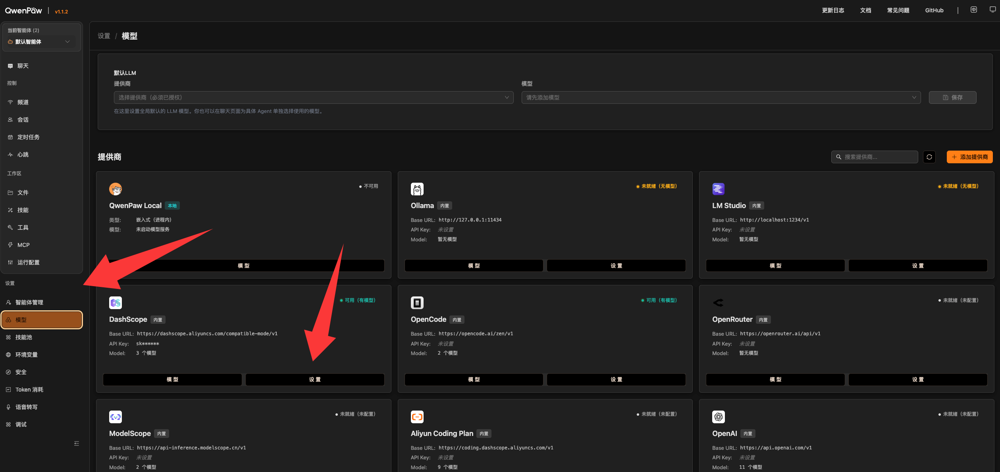

# 使用 NEKO 接入 QwenPaw

## QwenPaw 安裝指南

### 第一步：安裝

無需手動配置 Python，一行指令就能自動完成安裝。腳本會自動安裝 `uv`、建立虛擬環境，並安裝 QwenPaw 與其依賴。注意：部分網路環境或企業權限管控下可能無法使用。

macOS / Linux：

```bash
curl -fsSL https://qwenpaw.agentscope.io/install.sh | bash
```

Windows（PowerShell）：

```powershell
irm https://qwenpaw.agentscope.io/install.ps1 | iex
```

### 第二步：初始化

安裝完成後，請開啟新終端並執行：

```bash
qwenpaw init --defaults
```

初始化時會出現安全警告，提醒你 QwenPaw 執行於本機環境，如果多人共用同一個實例，將共享檔案、命令與金鑰權限。閱讀後輸入 `yes` 繼續即可。


### 第三步：啟動

```bash
qwenpaw app
```

啟動成功後，終端最後一行通常會顯示：

```text
INFO:     Uvicorn running on http://127.0.0.1:8088 (Press CTRL+C to quit)
```

服務啟動後，造訪 `http://127.0.0.1:8088`，即可看到 QwenPaw 控制台。

### 第四步：替換人設檔案（非必須）

初始化完成後，QwenPaw 會自動建立設定目錄：

- Windows 預設為 `C:\Users\你的使用者名稱\.qwenpaw`
- macOS 預設為 `~/.qwenpaw`

因為 `.qwenpaw` 是隱藏資料夾，如有需要請先顯示隱藏檔案。

- Windows：在檔案總管顯示隱藏項目
- macOS：在 Finder 按 `Command + Shift + .`

如果你希望 QwenPaw 以 N.E.K.O 的純後台執行器身份工作，可以下載以下替換包：

- [替換文件.zip](assets/openclaw_guide/替换文件.zip)

將壓縮檔中的 `SOUL.md`、`AGENTS.md`、`PROFILE.md` 複製到 `.qwenpaw/workspaces/default` 中覆蓋原檔，並刪除該資料夾裡的 `BOOTSTRAP.md`。

完成後，先用 `CTRL+C` 停止目前的 QwenPaw，再重新執行：

```bash
qwenpaw app
```

## 基礎設定：模型設定

打開 QwenPaw 控制台後，進入「模型」頁面，選擇你要使用的模型提供商。新手最常見的是 `DashScope`，也可以根據自己的 API Key 選擇其他提供商。

點擊設定，填入 API Key 後儲存。



儲存後回到聊天頁面，就能選擇剛剛配置好的模型。

## 在 N.E.K.O 中啟用 OpenClaw

N.E.K.O 內部仍沿用 `openclaw` 這個名稱，所以介面中的 `OpenClaw` 開關實際上對應的就是 QwenPaw。

請依照以下順序操作：

1. 打開 N.E.K.O 的 Agent 面板
2. 先開啟 `Agent` 總開關
3. 確認 `openclawUrl` 指向 `http://127.0.0.1:8088`
4. 再開啟 `OpenClaw` 子開關
5. 等待可用性檢查通過

N.E.K.O 會優先嘗試 QwenPaw 的相容端點；若有需要，也會自動回退到主 `process` 端點。主接入流程不需要額外配置自訂頻道。
